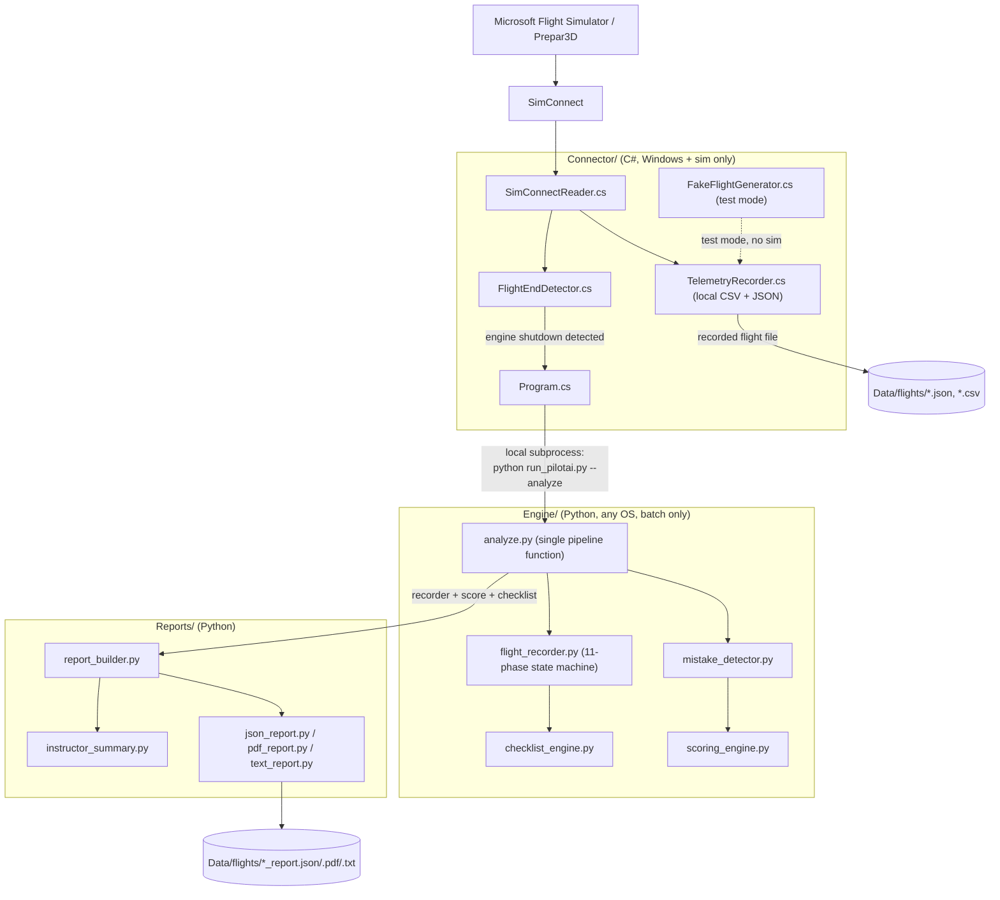
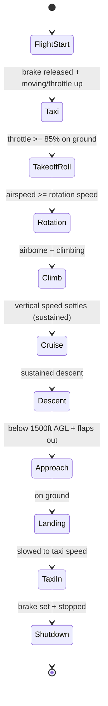

# Architecture

## Diagram

## Why this shape (and what changed)

PilotAI started as a live system: a TCP telemetry stream, a web dashboard,
voice coaching, a running Engine process with threads and locks. That
version is preserved in git history if it's ever needed again, but for a
co-op demonstration the actual requirement was much simpler: *a student
flies, and a professional report appears afterward, automatically, with
nothing running but the simulator.* Live coaching, a dashboard, and a
network protocol are all real engineering, but none of them are needed to
satisfy that requirement, and each one is something else that has to work
correctly on a demo floor. So they were removed, not just disabled --
see git history for `Dashboard/`, `Engine/coach.py`, `Engine/voice.py`,
`Engine/telemetry_source.py`'s TCP client/server, and
`Connector/TelemetryStreamer.cs`.

What's left is a **record, then analyze** pipeline:

1. The Connector starts recording the moment it connects to SimConnect
   (or, in `--test` mode / when SimConnect isn't available, the moment it
   starts generating a synthetic flight).
2. `FlightEndDetector.cs` watches telemetry locally and confirms "the
   flight is over" once the engine has genuinely run and then stops with
   the parking brake set and the aircraft stationary, sustained for a few
   seconds (to reject a single noisy sample).
3. The Connector finalizes the recording to disk and runs
   `python run_pilotai.py --analyze <file>` as a **local subprocess** --
   not a network call. This is the one boundary between the C# and Python
   halves, and it's one-directional and synchronous: the Connector waits
   for Python to finish, prints whether it succeeded, and is ready to
   record the next flight.
4. Python's `Engine/analyze.py` replays the whole recording through the
   same Flight Recorder / Checklist Engine / mistake detector / scoring
   engine, and `Reports/` renders the result as JSON, PDF, and text.

There is deliberately no long-running Python process for the Connector to
talk to, no port to keep open, and no dashboard to keep alive. `--test`
mode exercises the exact same Python-side pipeline the Connector triggers,
just without a Connector in front of it.

## Why the Flight Recorder is a single, shared implementation

`Engine/flight_recorder.py`'s phase state machine is the one and only
phase-detection implementation, used for the entire replay. Earlier
versions of this project had a live phase tracker and a separate batch one
that could disagree about where takeoff ended and landing began; this
version has one, which the whole analysis pipeline replays a recording
through. The same principle applies to `mistake_detector.py`: it's the
single source of truth for "what went wrong and when" (with a timestamp
attached to every finding), and `scoring_engine.py` only converts its
output into point deductions rather than running a second, separate set of
checks that could describe the same moment differently.

## Why a rules engine, not a trained model

"AI Flight Analyzer" and mistake detection are documented, tunable
thresholds over telemetry (see the constants at the top of
`mistake_detector.py` and `scoring_engine.py`), not a trained model. There
is no flight-training dataset available to fit a model to, and a rules
engine can be explained to a flight instructor in one sentence per finding
("descent rate exceeded -700 fpm on approach"), which matters when they're
deciding whether to trust a report a computer generated about their
student.

The same reasoning extends to the Instructor Summary
(`Reports/instructor_summary.py`): it's template-based and fully offline
by default. It's built as a `SummaryBackend` interface specifically so a
*local* LLM (e.g. Ollama on localhost) can optionally take over prose
generation without touching anything else in the report pipeline -- but
that's opt-in, off by default, and only ever talks to a backend on
localhost. If it's not configured, or the local server isn't reachable,
generation falls back to the template silently. PilotAI never calls a
cloud LLM API and never requires one.

## The 11-phase Flight Recorder state machine

This is a **single-flight, forward-only** state machine (see
[ROADMAP.md](ROADMAP.md) for touch-and-go support). Transitions use a
3-second sustained-condition check before confirming a phase change,
specifically to reject single-sample telemetry noise -- verified in
`Tests/test_flight_recorder.py`.

## Mistake categories and severities

`mistake_detector.py` evaluates six categories -- Takeoff, Climb, Cruise,
Approach, Landing, and the whole-flight Aircraft Control -- each producing
`Mistake` records (timestamp, phase, category, severity, explanation,
recommendation). Severities (`minor`/`moderate`/`major`) map to point
deductions in `scoring_engine.py`. A single event can legitimately count
against two categories at once -- e.g. a steep bank in cruise dings both
Cruise's own score and the holistic Aircraft Control score, the same way a
real instructor's rubric might mark both a phase-specific box and an
overall "aircraft handling" box for the same moment. That's intentional,
not double-counting a bug (see the comment in `evaluate_aircraft_control`).

## Data flow summary

| Stage | Input | Output |
|---|---|---|
| Connector | SimConnect simvars (or synthetic) | recorded flight file (`Data/flights/*.json`, `.csv`) |
| `FlightEndDetector.cs` | telemetry stream | "flight is over" signal -> triggers `run_pilotai.py --analyze` |
| `analyze.py` | recorded flight file | `(FlightRecorder, score_report, checklist_summary)` |
| `mistake_detector.py` | FlightRecorder | mistakes + strengths per category |
| `scoring_engine.py` | mistakes + checklist summary | 8 category scores |
| `report_builder.py` | recorder + score + checklist | one structured report dict |
| `instructor_summary.py` | report dict | Instructor Summary prose |
| `json_report.py` / `pdf_report.py` / `text_report.py` | report dict | `.json` / `.pdf` / `.txt` files |
